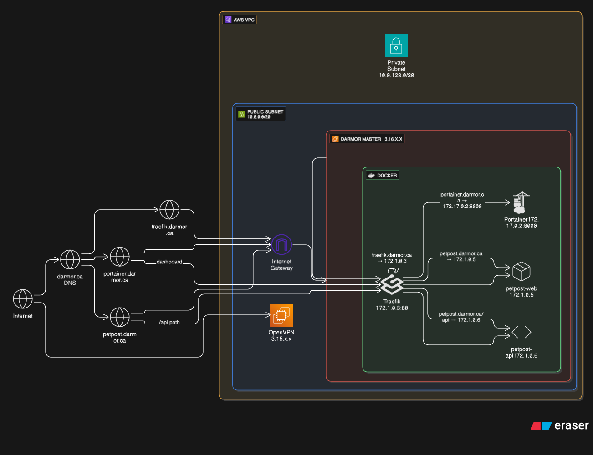

# PetPost

<a name="readme-top"></a> 

[![Contributors][contributors-shield]][contributors-url]
[![Forks][forks-shield]][forks-url]
[![Stargazers][stars-shield]][stars-url]
[![Issues][issues-shield]][issues-url]
[![MIT License][license-shield]][license-url]

<!-- TABLE OF CONTENTS -->
<details>
  <summary>Table of Contents</summary>
  <ol>
    <li>
    <a href="#introduction">Getting Started</a>
      <a href="#getting-started">Getting Started</a>
      <ul>
        <li><a href="#requirements">Requirements</a></li>
        <li><a href="#installation">Installation</a></li>
      </ul>
    </li>
    <li><a href="#code-of-conduct">Code of Conduct</a></li>
    <li><a href="#license">License</a></li>
    <li><a href="#disclaimer">Disclaimer</a></li>
  </ol>
</details>

<!-- INTRODUCTION -->
## Introduction

#### Demo Workflow


#### UML Workflow
<div align="center">
    
</div>

<!-- GETTING STARTED -->
## Getting Started

<!-- REQUIREMENTS -->
### Requirements

- Python 3.11.9

### Installation

#### Clone this repository
```bash
git clone https://github.com/DarmorGamz/PetPost.git
```

#### Build the Docker image
```bash
docker compose up --build
```

<p align="right">(<a href="#readme-top">back to top</a>)</p>


<!-- CODE OF CONDUCT -->
## Code of Conduct 

Please read [CODE_OF_CONDUCT.md](CODE_OF_CONDUCT.md) for details on our code of conduct.

<p align="right">(<a href="#readme-top">back to top</a>)</p>

<!-- LICENSE -->
## License

Distributed under the GPL License. See `LICENSE` for more information.

<p align="right">(<a href="#readme-top">back to top</a>)</p>


<!-- Disclaimer -->
## Disclaimer 

This project is intended for educational purposes only. The content, scripts, and tools provided in this repository are for demonstration and learning purposes and should not be used for commercial or production environments without proper evaluation and adaptation.

The creator of this repository, Darren Morrison, are not responsible for any misuse, damage, or legal issues that may arise from using the code or concepts presented here. Users are advised to use the information and code at their own risk and discretion.

[contributors-shield]: https://img.shields.io/github/contributors/DarmorGamz/PetPost.svg?style=for-the-badge
[contributors-url]: https://github.com/DarmorGamz/PetPost/graphs/contributors
[forks-shield]: https://img.shields.io/github/forks/DarmorGamz/PetPost.svg?style=for-the-badge
[forks-url]: https://github.com/DarmorGamz/PetPostm/network/members
[stars-shield]: https://img.shields.io/github/stars/DarmorGamz/PetPost.svg?style=for-the-badge
[stars-url]: https://github.com/DarmorGamz/PetPost/stargazers
[issues-shield]: https://img.shields.io/github/issues/DarmorGamz/PetPost.svg?style=for-the-badge
[issues-url]: https://github.com/DarmorGamz/PetPost/issues
[license-shield]: https://img.shields.io/github/license/DarmorGamz/PetPost.svg?style=for-the-badge
[license-url]: https://github.com/DarmorGamz/PetPost/blob/master/LICENSE.txt
